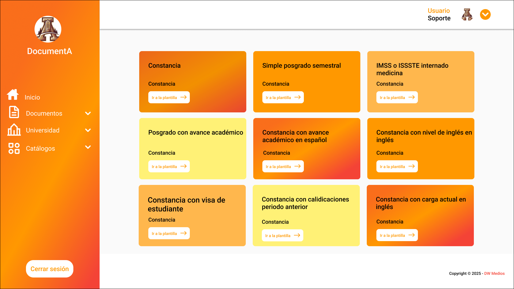

# DocumentA
Es un sistema de creación y gestión de documentos escolares 

## Objetivo
Mejorar la experiencia de usuario en un sistema para que sea sencillo de utilizar.

## Tools
- *Figma*
- *Principios de diseño UI/UX*: consistencia visual, accesibilidad, flujo de usuario

## Capturas de pantalla
Inicio 
|--------|
|  |

## Enlaces
- *Prototipo en Figma*: [Ver aquí](https://www.figma.com/design/XGqQO5LGD9a8xsIqkeM5us/DocumentA?node-id=0-1&t=BPHaZvmQADwq3NqW-1)

## Mi rol
Se diseñó las interfaces con base al sistema que estaba en desarrollo, definiendo correctamente el flujo de usuario y se realizaron las revisiones necesarias junto con el lider del proyecto

## Contributors ✨

<!-- ALL-CONTRIBUTORS-LIST:START - Do not remove or modify this section -->
<table>
  <tr>
    <td align="center">
      <a href="https://github.com/SNSCastillo">
        
         
        <b>Santos Castillo</b>
      </a>
       
      <em>ideas, code</em>
    </td>
    <td align="center">
      <a href="https://github.com/Slyfer020">
        
         
        <b>Linber Ake</b>
      </a>
       
      <em>ideas, design</em>
    </td>
  </tr>
</table>
<!-- ALL-CONTR
